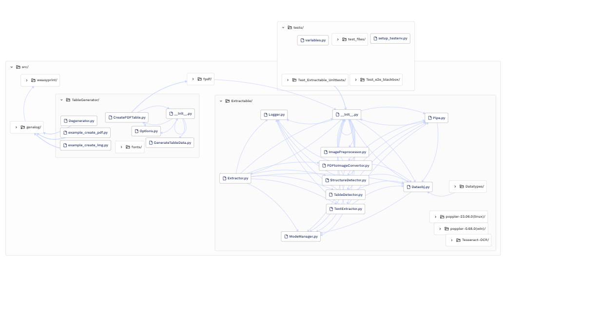

# Extractable: Table Extraction from PDFs using Machine Learning

Extractable is an open-source library designed to bring the power of state-of-the-art machine learning to everyone. Our goal is to make it easy for anyone to extract tables from PDFs, regardless of their technical expertise. Extractable is built on top of Microsoft's Open Source Table Transformer (TATR) library, which we have expanded to include a variety of new features and improvements.

## Features

Extractable is designed to be easy to use and highly flexible. Some of its key features include:

- **Table Extraction from PDFs**: Extractable uses machine learning models to extract tables from PDFs, enabling users to easily extract data from large datasets.

- **Open-Source and Collaborative**: Extractable is an open-source library designed for easy collaboration and contributions from the community.

- **PDF Test Table Generator**: We have developed a unique dataset to simulate real-world scenarios and benchmark machine learning models, identify the challenges and improve on specific areas. 

- **Comparative Analyses**: We have conducted extensive comparative analyses of various machine learning models to determine their effectiveness in extracting tables from PDFs.

- **Robust Data Pipelines**: We have designed and implemented robust data pipelines for processing and analyzing large volumes of PDF data, with a focus on code-readability and sustainability.

## Installation

To install Extractable, simply use pip:
```pip install Extractable```

Extractable is designed to be used with Python 3.10.

## Usage

To use Extractable, simply import the library and use its functions. We provide comprehensive documentation to get started with the library.

```python
import extractable

input_file = "path_to/your_input.pdf"
output_file = "path_to/your_preferred_output"

# Extract tables from a PDF file
tables = extractable.Extractor.extract(input_file, output_file)

# That's how simple it is!
```

## Architecture
To visualize the architecture of internal dependencies of this codebase, the extension 'Codesee' has been used. 
With every pull-request a Codesee bot will be called to analyze changes in the architecture and visualize it. Next to that, Codesee also provides useful insights into the code on-demand. This looks as follows:



## Contributing
Extractable is an open-source project and we welcome contributions from the community. If you would like to contribute, please take a look at our contribution guidelines and feel free to reach out to us on our GitHub repository.

## Maintainers
As maintainer one would want to test and publish new versions of Extractable. Testing is done using pytest and publishing on Pypi which will make it available on
```pip install```, below are the guides to accomplish different tasks with Extractable:

### For Testing
Before publishing one may want to run tests on the code to check if your newly written code hasn't changed the functionality of the codebase. 
This is called regression testing and this can be done by running the Unit- and e2e tests. You can do this with the following command:
```pdm run pytest -k "tests/ and Test_"```

After all tests have passed, one may want to test how the library functionality works in real-life. To test this we do not upload the library to the official Pypi.org filesystem, but we first upload it to test.pypi.org:

1. In the command line type ```pdm build``` which will automatically build the ```extractable-[version].tar.gz``` and ```extractable-[version]-py3-none-any.whl``` files, which are needed for Pypi
2. If you want to push it to the testing environment you can enter the following in the cmd: ```twine upload --repository-url https://test.pypi.org/legacy/ dist/extractable-[version]* --verbose``` and then enter your login info
3. Then open up a new project in your IDE and to be safe you can first enter ```pip uninstall Extractable``` before installing the testing library with: ```python -m pip install --index-url https://test.pypi.org/simple/ --extra-index-url https://pypi.org/simple Extractable==[version]```
That's it, you now have built and published your new version of the library to the testing environment.


### For Publishing
1. Go to ```src/version.py``` and change the version to the new version (old version +1). And go to the ```pyproject.toml``` file and  inside the ```[project]``` section change the ```version``` to the new version.
2. In the command line type ```pdm build``` which will automatically build the ```extractable-[version].tar.gz``` and ```extractable-[version]-py3-none-any.whl``` files, which are needed for Pypi
3. If you want to push it to the real pypi environment you can enter the following in the cmd: ```twine upload dist/extractable-[version]* --verbose``` and then enter your login info
4. Then pen a new project in your IDE and to be safe you can first enter ```pip uninstall Extractable``` before installing the testing library with: ```python -m pip install --index-url https://test.pypi.org/simple/ --extra-index-url https://pypi.org/simple Extractable==[version]```
That's it, you now have built and published your new version of the library to the testing environment.


## License
This software is free to use, and I encourage anyone who finds it useful to use it in any way they see fit. While I have not applied any license to the software, I do ask that users respect Microsofts' authorship of the TATR software and give appropriate attribution when sharing or distributing it. Please note that I make no warranties or guarantees about the software's functionality, and I am not liable for any damages resulting from its use

## Acknowledgments
We would like to thank Microsoft for developing the TATR library and making it open-source. We have built upon their work to create Extractable, and we are grateful for their contribution to the open-source community.

